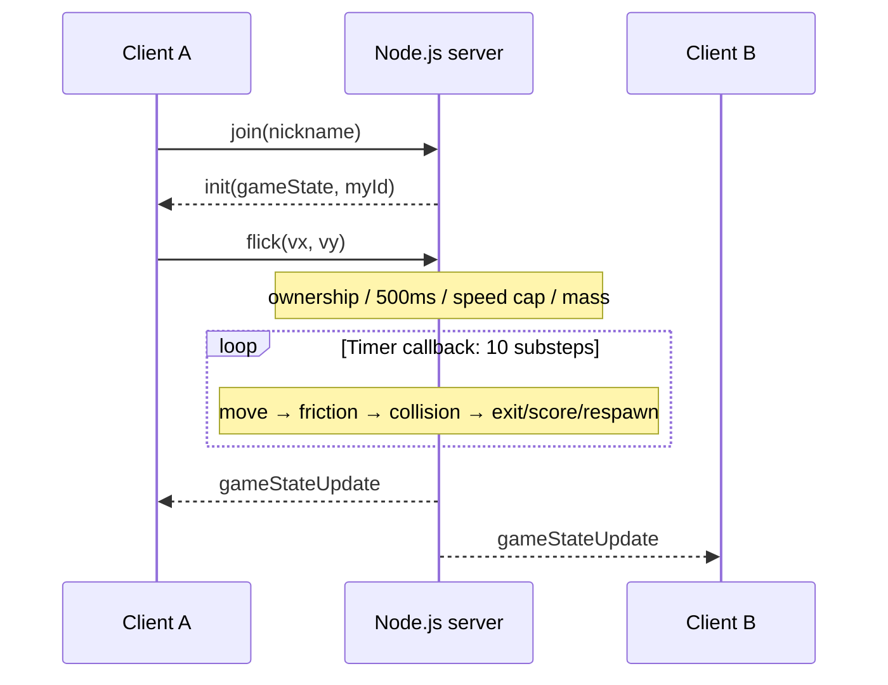

# Alkkagi.io — Technical Details

[Overview and setup](./README.en.md) · [한국어](./DETAILS.md)

This document preserves the portfolio's input, state-sharing and physics explanations against [source `530229c5`](https://github.com/SeMinKong/Alkkagi/tree/530229c524a432c0016a28376a5c6fccd8f8e5b5). Values and diagrams are implementation settings and explanatory calculations, not performance measurements or captured gameplay coordinates.

## 1. Authoritative server and contribution

I implemented the React aiming UI, Socket.IO communication, Node.js server, and TypeScript movement, friction, overlap and impulse functions. Server `gameState` contains `stones`, `players`, `boardSize`, and `rankings`. Stone position, velocity, radius, mass and last hitter live in server memory.



Clients apply received state to React state. `GameCanvas.tsx` renders stones as `<div>` elements, with SVG aiming/cooldown indicators. It is not an HTML Canvas physics engine. Client prediction and server reconciliation are absent.

## 2. Aiming and server input limits

[`App.tsx`](https://github.com/SeMinKong/Alkkagi/blob/530229c524a432c0016a28376a5c6fccd8f8e5b5/client/src/App.tsx) adjusts pointer coordinates for board scale/border and forms a vector opposite the drag:

```text
dx, dy      = dragStart - dragEnd
d           = min(sqrt(dx² + dy²), 300)
sensitivity = (boardSize / 500) × 0.05
power       = d^1.3 × sensitivity
angle       = atan2(dy, dx)
flick       = (cos(angle), sin(angle)) × power
```

[`server/index.ts`](https://github.com/SeMinKong/Alkkagi/blob/530229c524a432c0016a28376a5c6fccd8f8e5b5/server/index.ts#L139):

1. Finds the player by `socket.id`, then their `stoneId`. The client does not select an arbitrary target stone ID.
2. Rejects an input within 500ms of the last accepted input.
3. Caps the vector magnitude at `boardSize × 0.45`.
4. Divides that vector by mass and replaces velocity.
5. Records `lastFlickTime` and sets `lastHitBy` to the player's socket ID.

### Portfolio calculation example

```text
Input              (300, 400), magnitude 500
Board size         600
Server speed cap   600 × 0.45 = 270
Capped vector      (300, 400) × 270/500 = (162, 216)
Mass               1.5
Applied velocity   (162, 216) / 1.5 = (108, 144)
```

Velocity is expressed per server update, not as measured distance per second. The handler does not validate payload types or finite values with `Number.isFinite`. Ownership, cooldown and magnitude limits are not comprehensive schema validation or anti-cheat protection.

## 3. Substeps, damping and stopping

`SUB_STEPS = 10` makes one timer callback execute `updatePhysics(0.1)` ten times. Each substep moves/damps all stones, resolves collisions, then handles exits, scoring and respawn.

[`applyFrictionAndPosition`](https://github.com/SeMinKong/Alkkagi/blob/530229c524a432c0016a28376a5c6fccd8f8e5b5/server/physics.ts#L79):

```text
stepFactor = 1 / 10
position  += velocity × stepFactor
velocity  *= 0.8^stepFactor
if abs(vx) < 0.1: vx = 0
if abs(vy) < 0.1: vy = 0
```

Damping follows movement. Stopping checks each velocity component, not vector magnitude. Only without collisions, stop truncation or respawn does this identity hold:

```text
v_after = v_before × (0.8^0.1)^10 = 0.8 × v_before
```

Substeps increase collision sampling but do not guarantee continuous collision detection or prevent all high-speed tunneling. The timer uses `1000 / 60`ms with no actual elapsed-time correction. Delayed callbacks can change real-time simulation speed. This is a 60Hz target setting, not measured sustained FPS or a latency guarantee.

## 4. Position correction and impulses

[`resolveCollisions`](https://github.com/SeMinKong/Alkkagi/blob/530229c524a432c0016a28376a5c6fccd8f8e5b5/server/physics.ts#L31) examines every stone pair. For the ordinary case `0 < D < r1 + r2`:

```text
delta    = p2 - p1
D        = length(delta)
n        = delta / D
overlap  = r1 + r2 - D

p1 -= n × overlap/2
p2 += n × overlap/2
```

**Position correction is equal-half, independent of mass.** The implementation uses the `atan2(dy, dx)` direction. It then computes relative velocity along the original center-to-center normal:

```text
vn = dot(v2 - v1, n)
if vn > 0: skip impulse

e = 0.7
j = -(1 + e) × vn / (1/m1 + 1/m2)
v1 -= (j/m1) × n
v2 += (j/m2) × n
```

Already separating stones receive position correction without another impulse. Inverse mass determines velocity response: the heavier stone changes velocity less for the same impulse. Restitution `0.7` is not a perfectly elastic collision (`1.0`).

After the impulse branch, both `lastHitBy` fields identify the other player. At exactly coincident centers, the code substitutes distance `0.1`, but `dx = dy = 0` produces a degenerate normal. The ordinary impulse formula above does not establish robust resolution of that case. Coincident centers, multiple contacts and fast tunneling need regression coverage.

## 5. Board size, scoring, growth and respawn

On join/disconnect:

```text
boardSize = max(500, 400 + 100 × playerCount)
rankings  = top 10 players by descending score
```

A stone exits when its center crosses `-radius` or `boardSize + radius` on either axis. Crossing the board's center-coordinate bounds `0..boardSize` alone is insufficient.

1. Subtract `absorbedKills = floor(victim.kills / 2)` from the victim.
2. If `lastHitBy` identifies another currently connected player, award that player `1 + absorbedKills`.
3. Update victim/killer stone stats and rankings. Emit a kill notification when a valid killer exists.
4. Respawn the victim at independently random x/y in `[50, boardSize - 50)`, clear velocity and set `lastHitBy = null`.

The victim loses half their points even when no valid killer remains, including self-exit or a disconnected last hitter. Because points can be absorbed, `kills` is not simply the number of eliminated stones.

[`updateStoneStats`](https://github.com/SeMinKong/Alkkagi/blob/530229c524a432c0016a28376a5c6fccd8f8e5b5/server/physics.ts#L26):

```text
radius = 15 + 0.8 × kills
mass   = 1  + 0.05 × kills
```

Growth increases footprint and collision mass, while launch input divided by mass yields lower speed for the same vector. Random respawn does not search for a non-overlapping location.

## 6. Socket.IO events

| Direction | Event | Payload | Behavior |
| --- | --- | --- | --- |
| C→S | `join` | Nickname string | Create player/stone and update board/rankings |
| C→S | `flick` | `{ vx, vy }` | Apply owned-stone lookup, cooldown, cap and mass |
| S→C | `init` | `{ gameState, myId }` | Initial state for the joining socket |
| S→C | `gameStateUpdate` | `gameState` | Full state after ten substeps per timer callback |
| S→C | `killNotification` | `killer`, `victim`, `killerColor`, `victimColor` | Valid scoring event; client adds ID and a five-second display lifetime |
| Lifecycle | `disconnect` | Socket.IO event | Remove player/stones and update board/rankings |

Nickname length is limited in the UI, not equivalently enforced on the server. Repeated `join` from one socket is not separately rejected. Random HSL assignment does not guarantee unique colors.

## 7. Connection and state lifetime

The server binds to `0.0.0.0:3001`. The client connects to `http://<entered host>:3001`; HTTPS deployment needs compatible URL/transport configuration.

State exists in one process. Disconnect removes the player and stones; there is no persistent player ID or score recovery. Restart creates a new game. Multiple server instances do not share one game state, and reconnect does not restore the previous player.

## 8. Constants and verification scope

| Setting | Value | Meaning |
| --- | --- | --- |
| `BASE_RADIUS` | 15 | Initial radius |
| `BASE_SIZE` | 500 | Minimum board size |
| `FRICTION` | 0.80 | Reference damping factor per update |
| `STOP_SPEED` | 0.1 | Per-component stop threshold |
| `RESTITUTION` | 0.7 | Collision restitution |
| `SUB_STEPS` | 10 | Physics substeps per timer callback |
| Input interval | 500ms | Minimum interval between accepted flicks |
| Timer | `1000/60`ms | Target update interval, not measured FPS |

[Constants source](https://github.com/SeMinKong/Alkkagi/blob/530229c524a432c0016a28376a5c6fccd8f8e5b5/server/constants.ts). Source code and existing gameplay materials establish the described paths. This documentation update did not run new load, FPS or latency measurements. Server `npm test` is a placeholder; client build/lint do not establish multiplayer or physics correctness.

Future coverage can target malformed numeric input, repeated joins, coincident/multiple/high-speed collisions, score absorption, board shrinking, respawn and disconnect cleanup. Performance comparison requires controlled client counts and measurements of callback delay, state payload volume, and input-to-display latency.
