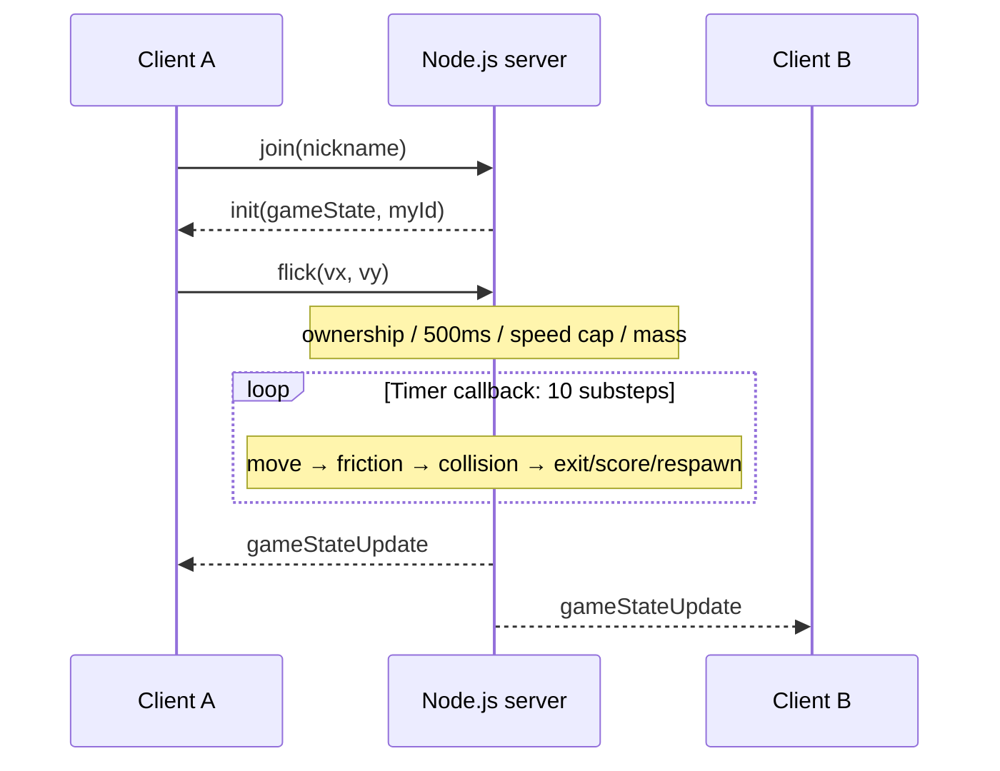

# Alkkagi.io 기술 상세

[프로젝트 소개·실행](./README.md) · [English](./DETAILS.en.md)

개인 프로젝트의 서버 입력·상태 공유·물리 계산과 기존 포트폴리오의 계산 예시를 정리합니다. 코드 기준은 [`530229c5`](https://github.com/SeMinKong/Alkkagi/tree/530229c524a432c0016a28376a5c6fccd8f8e5b5)입니다. 아래 수치와 도식은 구현 설정·수식 설명이며 실측 성능이나 실제 플레이 좌표가 아닙니다.

## 공세민의 구현 경험

2026-09-12 작성자 확인·승인 원고입니다.

### 직접 맡은 구현

- React와 Socket.IO로 조준 입력과 게임 상태를 연결하고, 서버에서 이동·충돌·득점을 계산해 모든 플레이어에게 공통 상태를 전달하도록 구현했습니다.
- 돌의 겹침을 해소하는 위치 보정과 질량·반발계수를 반영한 충격량 계산을 분리해 충돌 처리를 구현했습니다.
- 한 번의 상태 갱신을 10개 소단계로 나눠 이동·마찰·충돌을 계산하고, 보드 이탈에 따른 점수 이전·돌의 성장·재배치를 같은 흐름에 통합했습니다.

### 트러블슈팅

- **겹침과 충돌 반응 분리**: 돌이 겹쳐 있어도 이미 서로 멀어지고 있다면 추가 충격량을 적용할 필요가 없습니다. 겹친 위치를 먼저 보정하고, 충돌 방향의 상대 속도를 확인해 접근하는 경우에만 충격량을 적용하도록 구성했습니다.
- **소단계 감속 보정**: 물리 계산을 10번으로 나누면서 각 단계에 같은 마찰계수를 적용하면 감속이 과해집니다. 단계별 계수를 0.8**0.1로 보정해, 다른 충돌·정지·재배치 처리가 없는 경우 전체 10단계의 감속이 기존의 0.8배를 유지하도록 했습니다.

### 회고

물리 계산을 직접 구현하며 충돌 수식뿐 아니라 시간 간격과 처리 순서가 움직임에 영향을 준다는 점을 배웠습니다. 또한 여러 사용자가 같은 게임을 플레이하려면 판정의 기준 상태를 어디서 관리할지도 함께 설계해야 했습니다. 다음에는 고속 충돌과 다중 접촉을 반복 검증하고, 네트워크 지연과 동시 접속 부하가 플레이에 미치는 영향을 측정하고 싶습니다.

## 1. 서버가 기준 상태를 보관하는 구조

개인 구현 범위는 React 조준 UI, Socket.IO 통신, Node.js 서버, TypeScript의 이동·마찰·겹침·충격량 계산입니다. 서버의 `gameState`에는 `stones`, `players`, `boardSize`, `rankings`가 있습니다. 각 돌의 위치·속도·반경·질량·마지막 충돌자도 서버 메모리에서 관리합니다.



클라이언트는 수신 상태를 React state에 반영해 표시합니다. `GameCanvas.tsx`는 돌을 `<div>`로, 조준선과 쿨다운을 SVG로 그립니다. Canvas 기반 물리 엔진이나 클라이언트 예측·서버 결과 재조정은 사용하지 않습니다.

## 2. 조준 벡터와 서버 입력 제한

[`client/src/App.tsx`](https://github.com/SeMinKong/Alkkagi/blob/530229c524a432c0016a28376a5c6fccd8f8e5b5/client/src/App.tsx)는 화면 좌표에서 보드 배율·테두리를 보정하고 드래그 반대 방향의 속도 벡터를 만듭니다.

```text
dx, dy      = dragStart - dragEnd
d           = min(sqrt(dx² + dy²), 300)
sensitivity = (boardSize / 500) × 0.05
power       = d^1.3 × sensitivity
angle       = atan2(dy, dx)
flick       = (cos(angle), sin(angle)) × power
```

[`server/index.ts`](https://github.com/SeMinKong/Alkkagi/blob/530229c524a432c0016a28376a5c6fccd8f8e5b5/server/index.ts#L139)는 수신한 벡터를 그대로 최종 속도로 쓰지 않습니다.

1. `socket.id`에 해당하는 플레이어와 그 플레이어의 `stoneId`로 돌을 찾습니다. 클라이언트가 임의의 돌 ID를 지정하는 구조가 아닙니다.
2. 마지막 입력으로부터 500ms 미만이면 거절합니다.
3. 벡터 크기를 `boardSize × 0.45` 이하로 제한합니다.
4. 제한된 벡터를 돌의 질량으로 나눠 새 속도로 덮어씁니다.
5. 입력을 수락하면 `lastFlickTime`과 `lastHitBy = socket.id`를 기록합니다.

### 포트폴리오의 계산 예시

```text
입력 벡터        (300, 400)       크기 500
보드 크기        600
서버 상한        600 × 0.45 = 270
제한된 벡터      (300, 400) × 270/500 = (162, 216)
질량             1.5
적용 속도        (162, 216) / 1.5 = (108, 144)
```

속도는 서버 갱신 단위의 값으로, 초당 거리의 실측값이 아닙니다. 서버는 소유 관계·쿨다운·크기를 제한하지만 `vx`, `vy`의 타입·유한성 검사(`Number.isFinite`)를 하지 않습니다. 따라서 이 입력 경로를 완전한 검증이나 치트 방지로 설명하지 않습니다.

## 3. 소단계 이동·마찰·정지

[`constants.ts`](https://github.com/SeMinKong/Alkkagi/blob/530229c524a432c0016a28376a5c6fccd8f8e5b5/server/constants.ts)의 `SUB_STEPS = 10`에 따라 하나의 타이머 콜백이 열 번 `updatePhysics(0.1)`을 실행합니다. 각 소단계는 모든 돌의 이동·마찰, 충돌, 보드 이탈·득점·재배치 순서입니다.

[`applyFrictionAndPosition`](https://github.com/SeMinKong/Alkkagi/blob/530229c524a432c0016a28376a5c6fccd8f8e5b5/server/physics.ts#L79):

```text
stepFactor = 1 / 10
position  += velocity × stepFactor
velocity  *= 0.8^stepFactor
if abs(vx) < 0.1: vx = 0
if abs(vy) < 0.1: vy = 0
```

마찰은 이동 뒤에 적용됩니다. 정지 조건은 벡터 크기가 아니라 x/y 성분별 절댓값입니다. 충돌·정지 절삭·재배치가 없는 경우에만 다음 관계가 성립합니다.

```text
v_after = v_before × (0.8^0.1)^10 = 0.8 × v_before
```

소단계는 충돌을 더 자주 확인하지만, 고속 물체의 통과를 항상 막는 연속 충돌 검출은 아닙니다. 타이머는 `1000 / 60`ms로 설정되어 있고 실제 경과 시간에 따라 `stepFactor`를 보정하지 않습니다. 서버 콜백이 늦어지면 현실 시간 기준 진행 속도가 달라질 수 있으므로 60Hz 설정을 지속 60 FPS나 지연 보장으로 읽지 않아야 합니다.

## 4. 겹침 보정과 충격량

[`resolveCollisions`](https://github.com/SeMinKong/Alkkagi/blob/530229c524a432c0016a28376a5c6fccd8f8e5b5/server/physics.ts#L31)는 모든 돌 쌍을 검사합니다. 일반적인 경우 `0 < D < r1 + r2`일 때 다음 계산을 합니다.

```text
delta    = p2 - p1
D        = length(delta)
n        = delta / D
overlap  = r1 + r2 - D

p1 -= n × overlap/2
p2 += n × overlap/2
```

**위치 보정은 질량과 관계없이 절반씩** 나눕니다. 구현은 `atan2(dy, dx)`의 방향을 사용합니다. 그 후 원래 두 중심을 잇는 법선으로 상대 속도를 계산합니다.

```text
vn = dot(v2 - v1, n)
if vn > 0: 충격량 적용 생략

e = 0.7
j = -(1 + e) × vn / (1/m1 + 1/m2)
v1 -= (j/m1) × n
v2 += (j/m2) × n
```

이미 멀어지는 돌의 위치도 먼저 분리하지만 추가 충격량은 주지 않습니다. 속도 변화에는 역질량이 들어가므로 같은 충격량에서 무거운 돌의 속도 변화가 작습니다. `e = 0.7`은 완전 탄성 충돌(`e = 1`)이 아닙니다.

충격량 처리 분기를 통과하면 양쪽 `lastHitBy`를 상대 플레이어로 기록합니다. 정확히 같은 중심에서는 코드가 나눗셈용 거리를 `0.1`로 대체하지만 `dx = dy = 0`인 법선이 퇴화하므로 위 일반식과 같은 충격량 해소를 보장하지 않습니다. 이 경우와 다중 접촉·고속 통과는 회귀 테스트가 필요한 경계 조건입니다.

## 5. 보드·득점·성장·재배치

플레이어 참가·연결 종료 시 보드 크기를 바꿉니다.

```text
boardSize = max(500, 400 + 100 × playerCount)
rankings  = 점수 내림차순 상위 10명
```

돌의 중심이 `x < -radius`, `x > boardSize + radius`, 또는 y축의 같은 조건에 도달하면 보드 밖으로 판정합니다. 단순히 중심이 0 또는 보드 크기를 넘는 즉시 탈락하는 것은 아닙니다.

1. 피해자의 점수 절반을 내림한 `absorbedKills = floor(victim.kills / 2)`를 피해자 점수에서 뺍니다.
2. `lastHitBy`가 자신이 아닌 접속 중 플레이어이면 그 플레이어에게 `1 + absorbedKills`를 더합니다.
3. 피해자와 득점자의 돌 크기·질량 및 순위를 갱신합니다. 유효한 득점자가 있을 때 킬 알림을 보냅니다.
4. 피해 돌을 현재 보드의 x/y 각각 `[50, boardSize - 50)` 범위에 무작위 배치하고 속도를 0, `lastHitBy`를 `null`로 초기화합니다.

자기 입력으로 혼자 이탈하거나 마지막 충돌자가 이미 떠났다면 유효한 득점자가 없어도 피해자의 점수 절반 차감은 일어납니다. 한 번의 제거는 상대 점수 흡수로 여러 점이 될 수 있으므로 `kills`는 단순 처치 횟수와 같지 않습니다.

[`updateStoneStats`](https://github.com/SeMinKong/Alkkagi/blob/530229c524a432c0016a28376a5c6fccd8f8e5b5/server/physics.ts#L26):

```text
radius = 15 + 0.8 × kills
mass   = 1  + 0.05 × kills
```

큰 돌은 범위와 충돌 질량이 늘지만, 발사 입력을 질량으로 나누므로 같은 입력으로 얻는 속도는 줄어듭니다. 무작위 재배치는 다른 돌과 겹치지 않는 위치를 탐색하는 방식은 아닙니다.

## 6. Socket.IO 이벤트

| 방향 | 이벤트 | 데이터 | 처리 |
| --- | --- | --- | --- |
| C→S | `join` | 닉네임 문자열 | 플레이어·돌 생성, 보드·순위 갱신 |
| C→S | `flick` | `{ vx, vy }` | 소유 돌·쿨다운·속도 상한·질량 적용 |
| S→C | `init` | `{ gameState, myId }` | 참가한 소켓에 초기 상태와 ID 전송 |
| S→C | `gameStateUpdate` | `gameState` | 타이머 콜백의 10개 소단계 뒤 전체 상태 배포 |
| S→C | `killNotification` | `killer`, `victim`, `killerColor`, `victimColor` | 유효한 득점 알림; 클라이언트가 ID·5초 표시 관리 |
| 연결 수명 | `disconnect` | Socket.IO 이벤트 | 플레이어 및 그 플레이어의 돌 제거, 보드·순위 갱신 |

닉네임은 클라이언트에서 길이를 제한하지만 서버에서 같은 제한을 강제하지 않습니다. 같은 소켓의 반복 `join`도 서버가 따로 차단하지 않습니다. 색상은 무작위 HSL이며 중복 없는 색 배정을 보장하지 않습니다.

## 7. 연결·배포·메모리 수명

서버는 `0.0.0.0:3001`에 바인딩하고 클라이언트는 입력 호스트의 `http://<host>:3001`로 연결합니다. HTTPS 배포를 위해서는 클라이언트의 서버 URL 구성과 전송 경로를 맞추는 작업이 필요합니다.

게임 상태는 단일 프로세스에 있습니다. 연결 종료 시 플레이어와 돌을 제거하고 점수를 복원할 영속 ID나 저장소는 없습니다. 서버 재시작도 새 상태로 시작합니다. 여러 서버 인스턴스가 동일 게임 상태를 공유하거나 재접속 시 이전 플레이어를 복원하는 기능은 없습니다.

## 8. 설정과 검증 범위

| 설정 | 값 | 의미 |
| --- | --- | --- |
| `BASE_RADIUS` | 15 | 최초 반경 |
| `BASE_SIZE` | 500 | 최소 보드 크기 |
| `FRICTION` | 0.80 | 한 갱신의 마찰 비율 기준 |
| `STOP_SPEED` | 0.1 | 속도 성분별 정지 절삭 |
| `RESTITUTION` | 0.7 | 충격량의 반발계수 |
| `SUB_STEPS` | 10 | 타이머 콜백당 물리 소단계 수 |
| 입력 간격 | 500ms | 수락한 발사 입력 간 최소 간격 |
| 타이머 | `1000/60`ms | 목표 갱신 간격; 실측 FPS 아님 |

소스와 기존 플레이 자료는 위 기능·계산 경로를 설명합니다. 이번 문서 갱신에서 새 부하 시험이나 FPS·지연 측정을 수행하지 않았습니다. 서버 `npm test`는 placeholder이고, 클라이언트의 build/lint도 멀티플레이·물리 검증을 대신하지 않습니다.

후속 검증은 입력 숫자·반복 참가 처리, 같은 중심·다중 충돌·고속 통과, 점수 흡수·보드 축소·재배치, 연결 종료 정리를 대상으로 할 수 있습니다. 같은 조건의 클라이언트 수를 정하고 콜백 지연·상태 전송량·입력에서 표시까지의 지연을 측정해야 성능을 비교할 수 있습니다.
