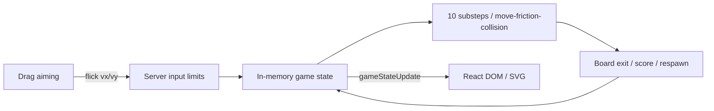

# Alkkagi.io

**[한국어](./README.md) · [Technical details](./DETAILS.en.md) · [Web portfolio](https://seminkong.github.io/SeMinKong_Web/work/alkkagi/)**

A real-time multiplayer browser game in which players drag and release their stones to knock opponents off the board. The server computes input limits, movement, friction, collisions, and scoring; clients provide aiming input and display state.

I built the React aiming UI, Socket.IO communication, Node.js game server, and TypeScript physics functions as an individual project from March to April 2026.

### Preview

<video src="https://github.com/user-attachments/assets/20bc9007-97ea-4cc4-948a-e1d901ea8f4b" width="600" controls></video>

[Open gameplay video](https://github.com/user-attachments/assets/20bc9007-97ea-4cc4-948a-e1d901ea8f4b)

## What I built

| Area | Implementation |
| --- | --- |
| Aiming UI | Drag-to-velocity conversion, selection of the local player's stone, aim and cooldown indicators |
| Input limits | Socket-owned stone lookup, 500ms cooldown, board-relative speed cap and mass adjustment |
| Server physics | Ten substeps of movement, friction, overlap correction and impulses |
| Game rules | Board exit detection, score transfer, respawn, radius/mass growth |
| Shared state | In-memory authoritative state broadcast through `gameStateUpdate` |
| Display | React DOM/CSS stones, SVG aim/cooldown, leaderboard and kill notifications |



## Design decisions

**Keep game decisions on the server.** The server applies cooldown, speed limits and mass to the submitted vector, then updates positions, velocities and scores in one place. This establishes an authority model; it is not a latency or concurrency benchmark.

**Separate positional correction from velocity response.** Overlap is split equally between both stones. An impulse is skipped when they are already separating along the collision normal; otherwise velocities use restitution `0.7` and inverse mass. Positional correction is not mass-weighted.

**Scale damping across substeps.** One update is split into ten steps, each multiplying velocity by `0.8 ** 0.1`. With no collisions, stop truncation or respawn, ten applications yield `0.8` times the initial velocity. The timer is configured at `1000 / 60`ms; there is no elapsed-time correction or guaranteed sustained 60 FPS.

[Technical details](./DETAILS.en.md) preserve input examples, collision equations, game rules and protocol contracts.

## Stack and structure

- React 19, TypeScript, Vite 8
- Node.js, Express, Socket.IO
- TypeScript physics, DOM/CSS and SVG rendering

```text
client/src/App.tsx                   Connection, socket and aiming input
client/src/components/GameCanvas.tsx DOM stones, SVG aim and cooldown
client/src/components/LeaderBoard.tsx Leaderboard
client/src/components/KillNotifications.tsx Kill notifications
server/index.ts                      Inputs, game loop, scoring, disconnects
server/physics.ts                    Position, friction, collisions and growth
server/constants.ts                  Game settings
```

`GameCanvas` is a component name; it does not use the HTML Canvas API.

## Getting started

Use Node.js **22.12 or later** and npm. The current lockfile's Vite 8 and React plugin require `^20.19.0 || >=22.12.0`.

```bash
git clone https://github.com/SeMinKong/Alkkagi.git
cd Alkkagi
```

Start the server in one terminal:

```bash
cd server
npm install
npm run dev
```

Open a second terminal at the repository root and start the client:

```bash
cd client
npm install
npm run dev
```

Use `npm.cmd` if PowerShell blocks the npm script. Open the URL printed by Vite, then enter a nickname and server host (`localhost` on the same computer). The client currently connects to `http://<entered host>:3001`; the server binds to `0.0.0.0:3001`.

Run `npm run build` and `npm run lint` from `client` for its build and static checks. The server's `npm test` is an unimplemented placeholder, not a verification suite.

## How to play

1. Enter a nickname and server host to join.
2. Click your gold-bordered stone and drag opposite the desired launch direction.
3. Release the mouse. Drag distance affects the input magnitude up to its cap.
4. Knock opponents off the board to gain points. Higher scores increase radius and mass, reducing velocity for the same launch input.

## Evidence and limitations

- This description follows [implementation `530229c5`](https://github.com/SeMinKong/Alkkagi/tree/530229c524a432c0016a28376a5c6fccd8f8e5b5) and existing gameplay material. Sustained FPS, network latency and concurrent capacity have not been measured.
- Game state exists only in one server process. Disconnect removes the player and stones; reconnect/restart score recovery is absent.
- Client prediction/reconciliation, continuous collision detection and complete input-schema validation are not implemented.
- Physics regression tests, finite-number input checks, repeated-join handling, and load/latency measurements remain future work. [Technical details](./DETAILS.en.md) describe edge cases.
