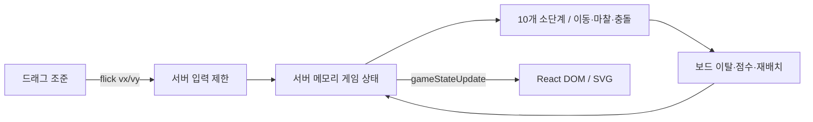

# Alkkagi.io

**[English](./README.en.md) · [기술 상세](./DETAILS.md) · [웹 포트폴리오](https://seminkong.github.io/SeMinKong_Web/work/alkkagi/)**

브라우저에서 자신의 돌을 드래그로 튕겨 상대 돌을 보드 밖으로 밀어내는 실시간 멀티플레이 게임입니다. 서버가 입력 제한·이동·마찰·충돌·득점을 계산하고, 클라이언트는 조준 입력과 상태 표시를 맡습니다.

2026.03–04 개인 프로젝트로 React 조준 UI, Socket.IO 통신, Node.js 게임 서버와 TypeScript 물리 함수를 구현했습니다.

## 직접 구현한 부분

- React와 Socket.IO로 조준 입력과 게임 상태를 연결하고, 서버에서 이동·충돌·득점을 계산해 모든 플레이어에게 공통 상태를 전달하도록 구현했습니다.
- 돌의 겹침을 해소하는 위치 보정과 질량·반발계수를 반영한 충격량 계산을 분리해 충돌 처리를 구현했습니다.
- 한 번의 상태 갱신을 10개 소단계로 나눠 이동·마찰·충돌을 계산하고, 보드 이탈에 따른 점수 이전·돌의 성장·재배치를 같은 흐름에 통합했습니다.

## 트러블슈팅

- **겹침과 충돌 반응 분리**: 돌이 겹쳐 있어도 이미 서로 멀어지고 있다면 추가 충격량을 적용할 필요가 없습니다. 겹친 위치를 먼저 보정하고, 충돌 방향의 상대 속도를 확인해 접근하는 경우에만 충격량을 적용하도록 구성했습니다.
- **소단계 감속 보정**: 물리 계산을 10번으로 나누면서 각 단계에 같은 마찰계수를 적용하면 감속이 과해집니다. 단계별 계수를 0.8**0.1로 보정해, 다른 충돌·정지·재배치 처리가 없는 경우 전체 10단계의 감속이 기존의 0.8배를 유지하도록 했습니다.

## 회고

물리 계산을 직접 구현하며 충돌 수식뿐 아니라 시간 간격과 처리 순서가 움직임에 영향을 준다는 점을 배웠습니다. 또한 여러 사용자가 같은 게임을 플레이하려면 판정의 기준 상태를 어디서 관리할지도 함께 설계해야 했습니다. 다음에는 고속 충돌과 다중 접촉을 반복 검증하고, 네트워크 지연과 동시 접속 부하가 플레이에 미치는 영향을 측정하고 싶습니다.

## Preview

<video src="https://github.com/user-attachments/assets/20bc9007-97ea-4cc4-948a-e1d901ea8f4b" width="600" controls></video>

[플레이 영상 열기](https://github.com/user-attachments/assets/20bc9007-97ea-4cc4-948a-e1d901ea8f4b)

## 구현한 내용

| 범위 | 구현 |
| --- | --- |
| 조준 UI | 드래그를 속도 벡터로 변환, 본인 돌 선택, 조준선·쿨다운 표시 |
| 입력 제한 | 접속자에 연결된 돌 확인, 500ms 재입력 거절, 보드 크기 비례 속도 상한과 질량 적용 |
| 서버 물리 | 열 번의 소단계 이동·마찰·겹침 보정·충격량 계산 |
| 게임 규칙 | 보드 이탈 판정, 득점 이전·재배치, 점수에 따른 반경·질량 변경 |
| 상태 공유 | 서버 메모리의 기준 상태를 `gameStateUpdate`로 배포 |
| 화면 | React DOM/CSS 돌 렌더링, SVG 조준선·쿨다운, 리더보드·킬 알림 |



## 핵심 설계 판단

**게임 판정을 서버에 모았습니다.** 클라이언트가 전달하는 발사 벡터에 서버가 쿨다운·속도 상한·질량을 적용하고, 위치·속도·점수를 한곳에서 갱신합니다. 이 구조는 판정의 기준을 정한 것이며 지연이나 동시 접속 성능을 측정한 결과는 아닙니다.

**위치 보정과 속도 반응을 분리했습니다.** 겹친 거리는 양쪽 돌에 절반씩 나누어 위치를 보정합니다. 이미 충돌 법선 방향으로 멀어지면 충격량을 생략하고, 그 외에는 반발계수 `0.7`과 역질량을 사용해 속도를 갱신합니다. 위치 보정은 질량 비례가 아닙니다.

**소단계에서 마찰을 반복 적용할 때 비율을 조절합니다.** 한 갱신을 10번으로 나누고 매번 `0.8 ** 0.1`을 곱합니다. 충돌·정지 절삭·재배치가 없다면 열 번 뒤 속도는 원래의 `0.8`배입니다. 타이머는 `1000 / 60`ms 설정이며 실제 경과 시간 보정이나 지속 60 FPS 보장은 없습니다.

[입력 계산 예시·충돌 수식·게임 규칙·이벤트 명세](./DETAILS.md)에 구현 세부를 정리했습니다.

## 기술 스택과 구조

- React 19, TypeScript, Vite 8
- Node.js, Express, Socket.IO
- TypeScript 물리 모듈, DOM/CSS·SVG 렌더링

```text
client/src/App.tsx                 접속·소켓·조준 입력
client/src/components/GameCanvas.tsx DOM 돌과 SVG 조준선·쿨다운
client/src/components/LeaderBoard.tsx 순위표
client/src/components/KillNotifications.tsx 킬 알림
server/index.ts                    입력·게임 루프·득점·연결 정리
server/physics.ts                  위치·마찰·충돌·돌의 성장
server/constants.ts                게임 설정
```

`GameCanvas`는 컴포넌트 이름이며 HTML Canvas API를 사용한다는 뜻은 아닙니다.

## 시작하기

Node.js **22.12 이상**과 npm을 사용합니다. 현재 클라이언트 lockfile의 Vite 8·React 플러그인 요구 범위는 `^20.19.0 || >=22.12.0`입니다.

```bash
git clone https://github.com/SeMinKong/Alkkagi.git
cd Alkkagi
```

첫 번째 터미널에서 서버를 실행합니다.

```bash
cd server
npm install
npm run dev
```

두 번째 터미널을 저장소 루트에서 열어 클라이언트를 실행합니다.

```bash
cd client
npm install
npm run dev
```

PowerShell에서 npm 스크립트 실행이 차단되면 `npm.cmd`를 사용합니다. Vite가 표시하는 로컬 URL을 열고 닉네임과 서버 호스트를 입력합니다. 같은 컴퓨터에서는 `localhost`를 입력하면 됩니다. 현재 클라이언트 접속 주소는 `http://<입력한 호스트>:3001`, 서버 바인딩은 `0.0.0.0:3001`입니다.

클라이언트 빌드와 정적 검사는 `client`에서 `npm run build`, `npm run lint`로 실행합니다. 서버의 `npm test`는 아직 테스트가 없는 placeholder이므로 검증 완료 명령으로 사용하지 않습니다.

## 게임 방법

1. 닉네임과 서버 호스트를 입력해 참가합니다.
2. 금색 테두리로 표시된 본인 돌을 클릭하고 발사할 방향의 반대로 드래그합니다.
3. 마우스를 놓아 돌을 튕깁니다. 드래그 거리는 상한까지 발사 입력의 크기에 반영됩니다.
4. 상대를 보드 밖으로 밀어내 점수를 얻습니다. 점수가 늘면 반경·질량이 커지고 같은 발사 입력의 속도는 줄어듭니다.

## 확인 범위와 남은 과제

- 설명은 [현재 구현 `530229c5`](https://github.com/SeMinKong/Alkkagi/tree/530229c524a432c0016a28376a5c6fccd8f8e5b5)와 기존 플레이 자료를 기준으로 합니다. 지속 FPS·네트워크 지연·동시 접속 수의 실측값은 없습니다.
- 서버 상태는 한 프로세스의 메모리에만 있습니다. 연결 종료 시 플레이어와 돌을 지우며 재접속·서버 재시작 후 점수 복구는 없습니다.
- 클라이언트 예측·서버 결과 재조정, 연속 충돌 검출, 완전한 입력 스키마 검증은 구현하지 않았습니다.
- 물리 회귀 테스트, 유한한 숫자 입력 검증, 반복 참가 처리, 부하·지연 측정이 후속 과제입니다. 자세한 경계 조건은 [기술 상세](./DETAILS.md)를 참고하세요.
